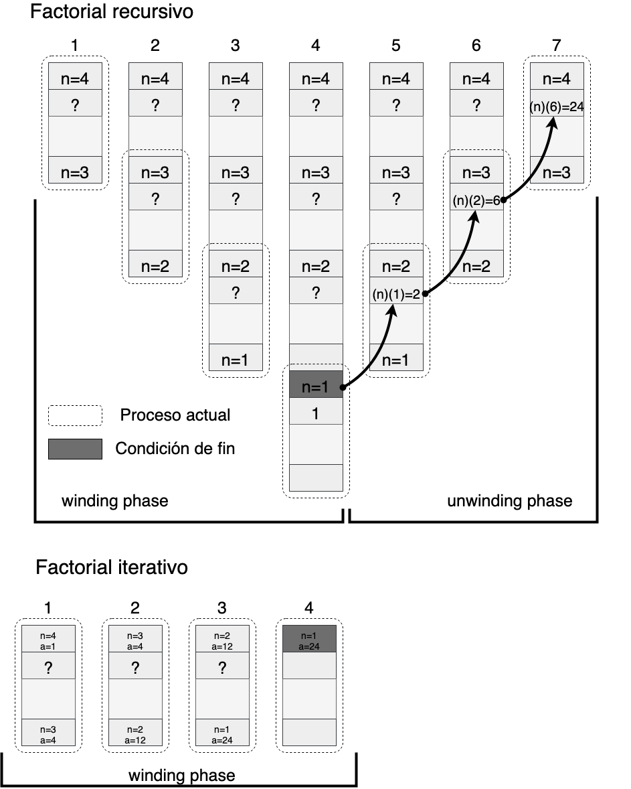

# Recursividad

Desarrolle el algoritmo de recursión para el cálculo del factorial de n donde n, es un número cualquiera.

1. Deberá realizar el cálculo mediante el uso de recursión, el programa deberá ser llamado factorial_recursivo.c
	Considere que la expresión matemática para el cálculo recursivo del factorial es la siguiente.
![[recursive_factorial.png]]

2. Deberá realizar el cálculo mediante el uso de iteración, el programa deberá ser llamado factorial_iterativo.c
	Considere que la expresión matemática para el cálculo iterativo del factorial es la siguiente.
![[iterative_factorial.png]]
