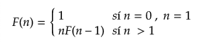
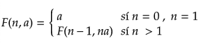

# Recursividad

Desarrolle el algoritmo de recursión para el cálculo del factorial de n donde n, es un número cualquiera.


1. Deberá realizar el cálculo mediante el uso de recursión, el programa deberá ser llamado factorial_recursivo.c
	Considere que la expresión matemática para el cálculo recursivo del factorial es la siguiente.



```
factRecursion(n) {
	if (n lt 0)
		return 0
	else if (n equal 0)
		return 1
	else if (n equal 1)
		return 1
	else
		return n * fact(n - 1)
}
```

2. Deberá realizar el cálculo mediante el uso de iteración, el programa deberá ser llamado factorial_iterativo.c
	Considere que la expresión matemática para el cálculo iterativo del factorial es la siguiente.


```
factTail(n, a) {
	if (n lt 0)
		return 0
	else if (n equal 0)
		return 1
	else if (n equal 1)
		return a
	else
		return factTail(n - 1, n * a)
}
```
