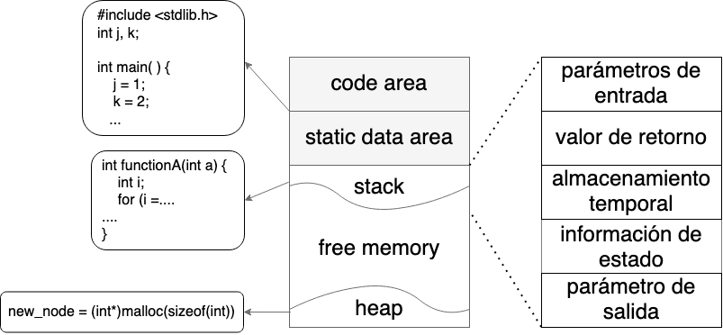
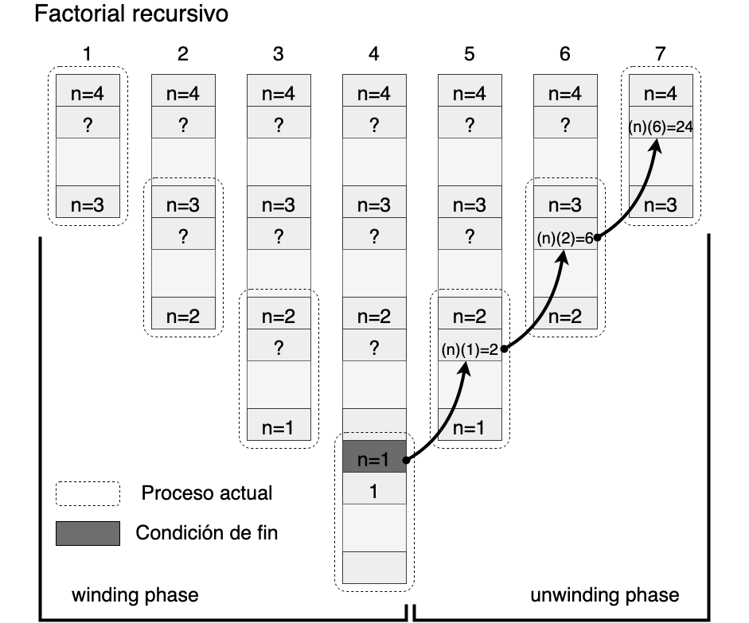
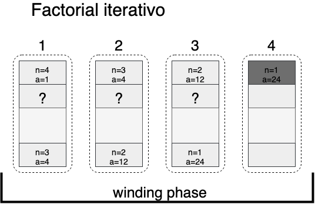

# Recursividad
## Recursión básica
Para comprender cómo funciona realmente la recursividad, es necesario conocer la forma en que se ejecutan las funciones en C. Para esto, debemos comprender un poco acerca de la organización de un programa C en la memoria RAM de una computadora. Fundamentalmente, un programa en C consta de cuatro áreas a medida que se ejecuta: un área de código, un área de datos estáticos, un heap y una pila (stack).

* El área de código contiene las instrucciones de la máquina que se ejecutan a medida que se ejecuta el programa.
* El área de datos estáticos contiene datos que persisten a lo largo de la vida del programa, como variables globales y variables locales estáticas.
* El heap contiene almacenamiento asignado dinámicamente, como la memoria asignada por malloc. La pila contiene información sobre las llamadas a funciones. Por convención, el heap crece hacia arriba desde un extremo de la memoria de un programa, mientras que la pila crece hacia abajo desde el otro (pero esto puede variar en la práctica).



*nota*: Es importante mencionar en este punto que esta organización de memoria de un programa en C no tiene nada que ver con colas de prioridad (priority queue) y heaps como estructuras de datos.

Por ejemplo, considera lo que sucede en la pila cuando se calcula 4!. La llamada inicial da como resultado que se coloque un registro de activación en la pila con un parámetro entrante de n = 4 (paso 1). Dado que esta activación no cumple ninguna de las condiciones de terminación de la función, fact se llama recursivamente con n establecido en 3. Esto coloca otra activación de fact en la pila, pero con un parámetro entrante de n = 3 (paso 2). Aquí, n = 3 también es un parámetro de salida de la primera activación, ya que la primera activación invocó a la segunda. El proceso continúa de esta manera hasta que n es 1, momento en el que se encuentra una condición de terminación y fact devuelve 1 (paso 4), se conoce a todo este proceso como fase de expansión de ala o fase de enrollado (winding phase).

Una vez que termina la activación n = 1, la expresión recursiva en la activación n = 2 se evalúa como (2)(1) = 2. Por lo tanto, la activación n = 2 termina con un valor de retorno de 2 (paso 5). En consecuencia, la expresión recursiva en la activación n = 3 se evalúa como (3)(2) = 6, y la activación n = 3 devuelve 6 (paso 6). Finalmente, la expresión recursiva en la activación n = 4 se evalúa como (4)(6) = 24, y la activación n = 4 termina con un valor de retorno de 24 (paso 7). En este punto, la función ha regresado de la llamada original y el proceso recursivo finaliza, este proceso se conoce como fase de retracción de ala o fase de desenrollado (unwiding phase).



## Recursividad de cola
Se dice que una función recursiva es recursiva de cola (tail) si todas las llamadas recursivas dentro de ella son recursivas de cola. Una llamada recursiva es recursiva final cuando es la última declaración que se ejecutará dentro del cuerpo de una función y su valor de retorno no es parte de una expresión. Las funciones recursivas de cola se caracterizan por no tener nada que hacer durante la fase de desenrollado. Esta característica es importante porque la mayoría de los compiladores modernos generan automáticamente código para aprovecharla.

Cuando un compilador detecta una llamada recursiva de cola, sobrescribe el registro de activación actual en lugar de insertar uno nuevo en la pila. El compilador puede hacer esto porque la llamada recursiva es la última instrucción que se ejecutará en la activación actual; por lo tanto, no queda nada por hacer en la activación cuando regresa la llamada. En consecuencia, no hay razón para mantener la activación actual. Al reemplazar el registro de activación actual en lugar de apilar otro encima, el uso de la pila se reduce considerablemente, lo que conduce a un mejor rendimiento en la práctica. Por lo tanto, deberíamos hacer que las funciones recursivas sean recursivas de cola siempre que podamos.

Para comprender cómo funciona la recursividad de cola, consideremos lo siguiente. Primero, es útil comprender la razón por la cual la definición anterior no era recursiva de cola. Recuerde que la definición original calculó n! multiplicando n veces (n – 1)! en cada activación, repitiendo esto para n = n – 1 hasta n = 1. Esta definición no era recursiva de cola porque el valor de retorno de cada activación dependía de multiplicar n por el valor de retorno de las activaciones posteriores. Por lo tanto, el registro de activación de cada llamada debía permanecer en la pila hasta que se determinaran los valores de retorno de las llamadas posteriores.



## Actividad

Desarrolle el algoritmo de recursión para el cálculo del factorial de n donde n, es un número cualquiera.

1. Deberá realizar el cálculo mediante el uso de recursión, el programa deberá ser llamado factorial_recursivo.c
	Considere que la expresión matemática para el cálculo recursivo del factorial es la siguiente.


```
factRecursion(n) {
	if (n lt 0)
		return 0
	else if (n equal 0)
		return 1
	else if (n equal 1)
		return 1
	else
		return n * fact(n - 1)
}
```

2. Deberá realizar el cálculo mediante el uso de iteración, el programa deberá ser llamado factorial_iterativo.c
	Considere que la expresión matemática para el cálculo iterativo del factorial es la siguiente.


```
factTail(n, a) {
	if (n lt 0)
		return 0
	else if (n equal 0)
		return 1
	else if (n equal 1)
		return a
	else
		return factTail(n - 1, n * a)
}
```

3. Indique la complejidad de cada uno de los algoritmos desarrollados.